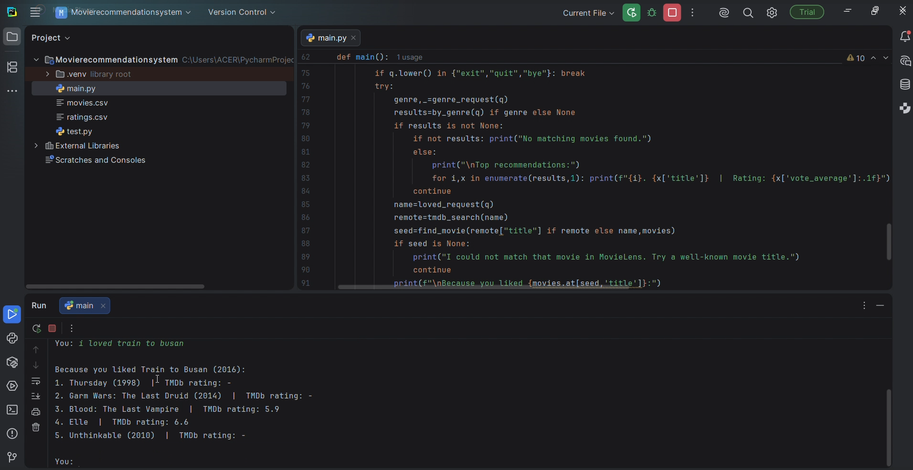
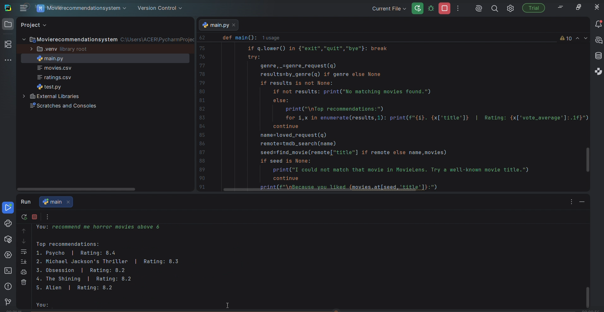
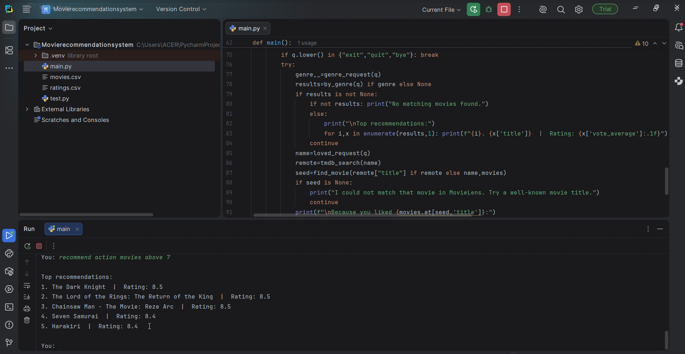

# CODSOFT_TASK4
AI-powered Movie Recommendation System developed in Python using the MovieLens dataset and TMDB API.

# Movie Recommendation System

## Overview

This project is an AI-powered Movie Recommendation System developed in Python as part of the CodSoft Artificial Intelligence Internship.

The system recommends movies based on user preferences using the MovieLens dataset and enhances recommendations by fetching movie details such as posters and information through the TMDB API.

## Features

- Movie recommendations
- MovieLens dataset integration
- TMDB API integration
- Displays movie posters and details
- Interactive and user-friendly interface

## Technologies Used

- Python
- Pandas
- Requests
- MovieLens Dataset
- TMDB API

## Project Files

- `main.py` – Main application
- `movies.csv` – Movie dataset
- `ratings.csv` – User ratings dataset

## How to Run

1. Install Python.
2. Install the required libraries:

```bash
pip install pandas requests
```

3. Add your TMDB API key (if required).

4. Run the project:

```bash
python main.py
```

## Output

The repository includes screenshots demonstrating the recommendation system in action.










## Author

**Shreoshree Mukherjee**
